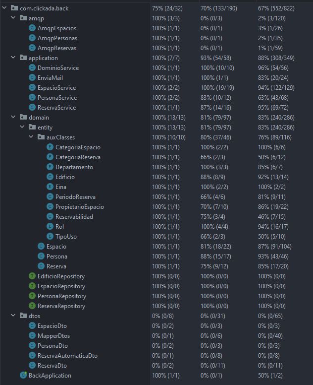

## Repositorio Backend

#### Para ejecutar el backend:

1.- Es necesario tener correctamente instalado Java y Apache Maven.

2.- Compilar e iniciar la aplicación AppTier, ejecutando desde el directorio back/AppTier:
 
```mvnw spring-boot:run```
 
3.- Compilar e iniciar la aplicación WebTier,  ejecutando desde el directorio back/WebTier:
 
```mvnw spring-boot:run```

#### Integración continua:
[](https://eu.buddy.works/samuelosbs/back/pipelines/pipeline/183049)

#### Cobertura de tests. Estado actual:
